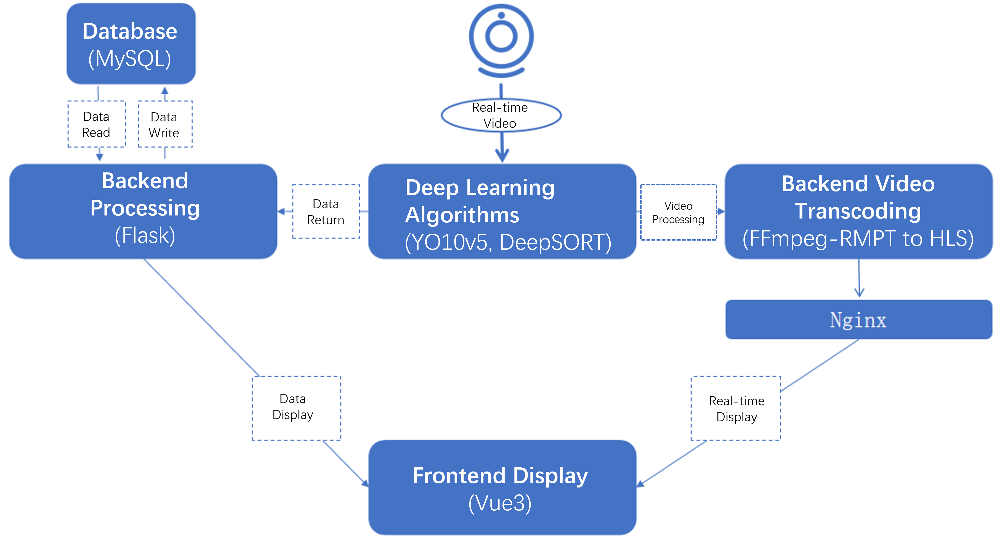
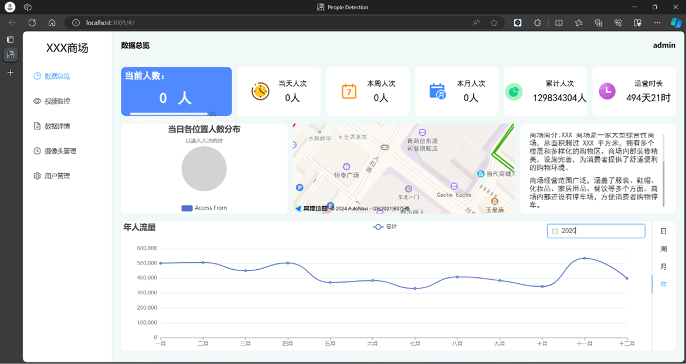
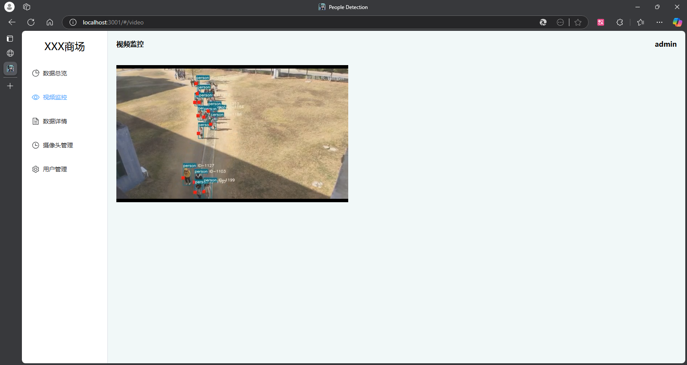
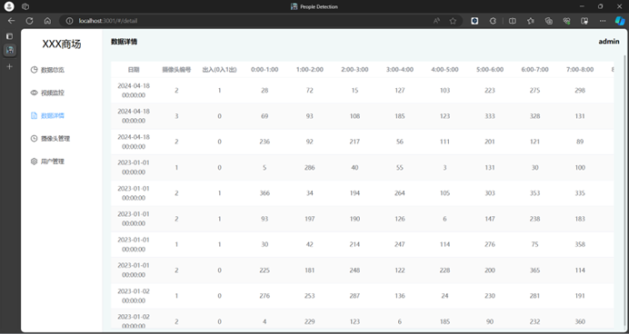
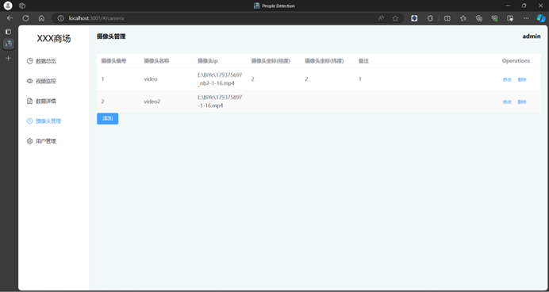

## 概要
このプロジェクトは、ディープラーニングを用いて多目的の歩行者検出とリアルタイムストリーミング処理を実現することを目的としています。システム全体は、フロントエンド、バックエンド、データベース、メディア処理、およびディープラーニングモジュールで構成され、処理された結果はバックエンドに送信されて保存され、処理されたビデオはストリーミングメディアを介してフロントエンドに表示されます。フロントエンドはVueフレームワークを使用し、element-uiとEchartsを組み合わせて人流量データのチャート分析機能を実現しています。バックエンドはFlaskを使用し、データの受信・送信とユーザー権限管理を実装しています。

## 技術スタック
- **フロントエンド:** vue3 + element-ui + Echarts + 高德地图api
- **バックエンド:** flask + mysql
- **人工知能:** pytorch + yolov5 + deepsort
- **デプロイ:** nginx

## 機能の特徴
- カメラを動的に追加・削除でき、拡張性が高い。
- 既存のカメラに直接接続でき、個別のインストールは不要。
- 日、週、月、年単位で人流量を分析可能。
- ユーザー権限管理が可能で、異なるユーザーが異なる権限を持つ。
- 人数情報がリアルタイムで更新される。

## プロジェクトの実行
#### データベース
1. MySQLデータベースを作成する。
2. mysqlフォルダ内のSQLファイルに従ってデータを初期化する。

#### バックエンド
1.エントリーファイルを実行する：camera_management_sys.py

####  フロントエンド
1. Vueフォルダに移動する。
2.vite.config.jsファイルのtargetをバックエンドのアドレスに変更する。
3.video.vue内のストリーミングサーバーアドレスを変更する。
4.プロジェクトディレクトリで以下のコマンドを実行してパッケージファイルをダウンロードし、インストールする：cnpm install
5.実行する：npm run dev

#### ストリーミングサーバー
このプロジェクトでは、nginxを使用してストリーミングサーバーを構築しています。nginxとnginx-rtmp-moduleプラグインをインストールする必要があります。

#### ディープラーニングアルゴリズム
1. ffmpegをインストールする。
2. 実行環境：
    - python 3.9、pip 20+
    - pytorch
    - pip install -r requirements.txt
3. main.py内のデータアップロードアドレスとストリーミングサーバーアドレスを変更する
4. 環境を設定した後、main.pyを直接実行する：bysj.py

## 全体アーキテクチャ

## プロジェクトスクリーンショット

## 参考資料
- [VUE公式サイト](https://vuejs.org/)
- [Element-UI](https://element-plus.org/zh-CN/)
- [Echarts](https://echarts.apache.org/zh/index.html)
- [docker-nginx-rtmp](https://github.com/alfg/docker-nginx-rtmp)
- [yolov5 deepsort 歩行者 車両 追跡 検出 カウント](https://github.com/dyh/unbox_yolov5_deepsort_counting)