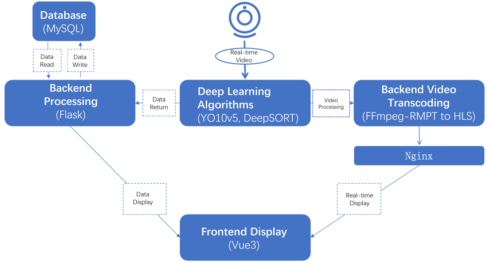
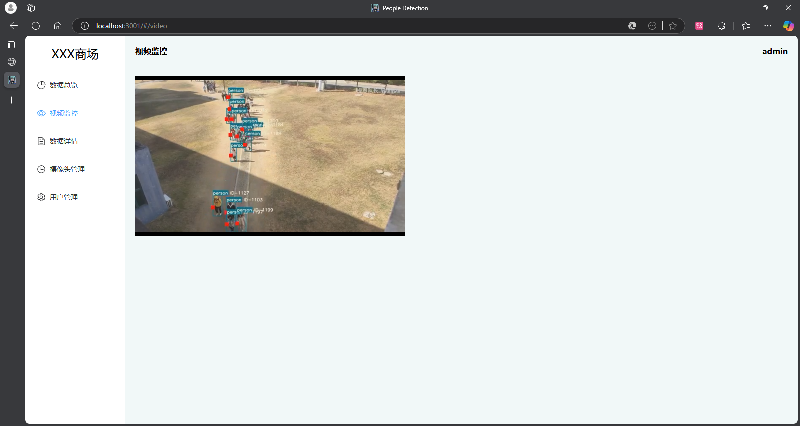
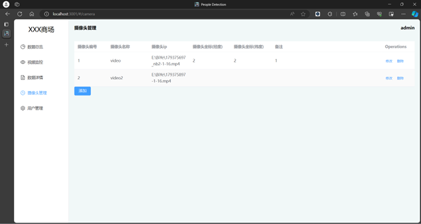

## 简介 
本项目旨在通过深度学习实现多目标行人检测和实时流媒体处理。整个系统由前端、后端、数据库、媒体处理、和深度学习模块组成，将处理后的结果发给后端保存，处理后的视频经流媒体发给前端显示；前端使用Vue框架，结合element-ui、Echarts实现了对人流量数据的图表分析功能。后端采用Flask，实现数据的接收发送与用户权限管理。  

## 技术栈
- **前端：** vue3 + element-ui + Echarts + 高德地图api
- **后端：** flask + mysql
- **人工智能：** pytorch + yolov5 + deepsort
- **部署：** nginx


## 功能特色
- 可动态的添加删除摄像头，扩展性好;
- 可直接接入现有摄像头，无需单独安装;
- 可以以日、周、月、年为单位进行人流量分析;
- 可对用户进行权限管理，不同用户拥有不同的权限;
- 人数信息实时更新;


## 项目运行
#### 数据库
1. 创建mysql数据库
2. 根据mysql文件夹下的sql文件初始化数据

#### 后端
1. 进入Spring boot文件夹
2. 修改application.yml，配置数据源和端口
3. 运行入口文件：```camera_management_sys.py```

####  前端
1. 进入Vue文件夹
2. 修改vite.config.js文件的target为后端地址
3. 修改video.vue中的流媒体服务器地址。
4. 在项目目录运行命令下载并安装包文件：```cnpm install```
5. 运行：```npm run dev```

#### 流媒体服务器
本项目采用nginx搭建流媒体服务器，需安装nginx和nginx-rtmp-module插件。

#### 深度学习算法
1. 安装[ffmpeg](https://ffmpeg.org/)
2. 运行环境：
    - python 3.9，pip 20+
    - pytorch
    - pip install -r requirements.txt
3. 修改main.py中的数据上传地址和流媒体服务器地址
4. 配置好环境后直接运行main.py：```bysj.py```

## 整体架构
<p align="center">

</p>

## 项目截图

<p align="center">

</p>
<p align="center">

</p>
<p align="center">

</p>
<p align="center">

</p>


## 参考资料
- [VUE官网](https://vuejs.org/)
- [Element-UI](https://element-plus.org/zh-CN/)
- [Echarts](https://echarts.apache.org/zh/index.html)
- [高德地图开放平台](https://console.amap.com/)
- [docker-nginx-rtmp](https://github.com/alfg/docker-nginx-rtmp)
- [yolov5 deepsort 行人 车辆 跟踪 检测 计数](https://github.com/dyh/unbox_yolov5_deepsort_counting)